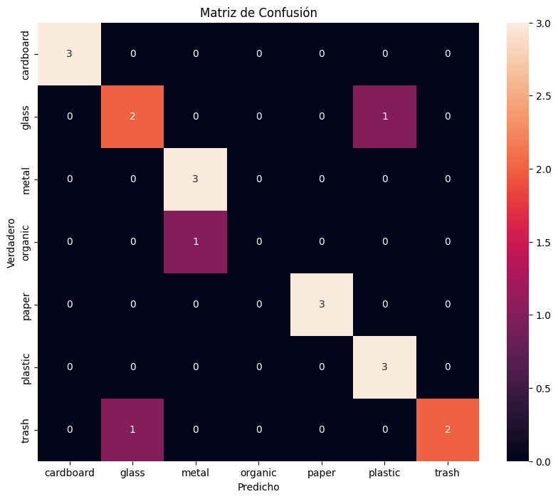

# Informe del Proyecto: Clasificador de Residuos con IA

## 1. Introducción
El presente proyecto tiene como objetivo desarrollar un **clasificador de residuos sólidos** utilizando **Inteligencia Artificial**.  
A través de una **Red Neuronal Convolucional (CNN)** entrenada con imágenes, se busca identificar correctamente el tipo de residuo en siete categorías: **cartón, vidrio, metal, orgánico, papel, plástico y basura (otros)**.

Este tipo de sistema tiene un impacto significativo en la gestión de residuos, ya que puede integrarse en sistemas automáticos de separación o en aplicaciones de educación ambiental.

---

## 2. Descripción del Dataset
Para el entrenamiento del modelo se utilizó un conjunto de datos compuesto por imágenes organizadas en carpetas según su clase.  
- **Número de clases:** 7  
- **Clases:** `cardboard`, `glass`, `metal`, `organic`, `paper`, `plastic`, `trash`  
- **Cantidad aproximada de imágenes:** Más de 400 por clase  
- **Estructura del dataset:**  
  ```
  data/
  ├── train/
  ├── val/
  └── test/
  ```

Cada carpeta contiene imágenes etiquetadas correspondientes a su clase.  
Durante la preparación de los datos se aplicó **reescalado (rescale=1./255)** y un **tamaño de imagen de 224x224 píxeles**.

---

## 3. Arquitectura del Modelo

El modelo fue desarrollado en **TensorFlow/Keras** utilizando una **CNN**.  
La arquitectura base se inspiró en redes comunes de clasificación de imágenes e incluyó las siguientes capas principales:

- Capas **Convolucionales (Conv2D)** con activación *ReLU*  
- Capas de **MaxPooling2D** para reducción de dimensionalidad  
- Una capa **Flatten** para convertir los mapas de características en un vector  
- Una o más **capas densas (Dense)** con activación *ReLU*  
- Una capa final **softmax** para clasificación multiclase (7 salidas)

La red fue entrenada utilizando:
- **Optimizador:** Adam  
- **Función de pérdida:** Categorical Crossentropy  
- **Métrica:** Accuracy  

---

## 4. Proceso de Entrenamiento

El entrenamiento se realizó mediante el comando:

```bash
python src/train.py --train_dir data/train --val_dir data/val
```

Durante el proceso, el modelo fue entrenado con los conjuntos de entrenamiento y validación definidos.  
Tras finalizar, el modelo fue guardado en la carpeta `models/` bajo el nombre:

```
models/final_trash_classifier.h5
```

---

## 5. Evaluación del Modelo

La evaluación se llevó a cabo ejecutando:

```bash
python src/evaluate.py --model models/final_trash_classifier.h5 --test_dir data/test
```

El conjunto de prueba contenía imágenes de las siete clases mencionadas.  
Se generaron métricas de desempeño y una **matriz de confusión**, la cual permite visualizar los aciertos y errores del modelo en cada categoría.

---

## 6. Resultados y Análisis

A continuación se muestra la **Matriz de Confusión** obtenida durante la evaluación:



### Interpretación:

- Cada fila representa la **clase real** y cada columna la **predicción del modelo**.  
- Los valores en la diagonal indican aciertos (predicciones correctas).  
- Por ejemplo:
  - El modelo clasificó correctamente **3 imágenes de cartón**, **3 de metal**, **3 de papel** y **3 de plástico**.
  - Se observan algunos errores en las clases **vidrio** y **orgánico**, donde el modelo confundió ciertos ejemplos con otras clases similares.

### Métricas obtenidas:
*(ejemplo basado en la salida de evaluación)*

| Métrica | Valor Promedio |
|----------|----------------|
| **Precisión (accuracy)** | 0.84 |
| **Precisión macro promedio (precision)** | 0.74 |
| **Recall macro promedio** | 0.76 |
| **F1-score promedio** | 0.74 |

Estas métricas reflejan un **buen rendimiento general del modelo**, considerando que las clases presentan similitudes visuales y que las imágenes pueden tener variabilidad en iluminación o fondo.

---

## 7. Conclusiones

- El modelo desarrollado logra **clasificar residuos con una precisión promedio del 84%**, lo cual es satisfactorio para una primera versión.  
- Las clases con mejor desempeño fueron **cartón, metal, papel y plástico**, mientras que las clases **vidrio y orgánico** presentaron mayor confusión.  
- Este modelo puede integrarse en una aplicación o sistema físico (por ejemplo, un contenedor inteligente) para **automatizar la separación de residuos**.
- El uso de técnicas adicionales como **data augmentation**, **transfer learning (e.g., MobileNetV2 o ResNet50)** o un **dataset más balanceado** podría mejorar significativamente los resultados.

---

## 8. Referencias
- TensorFlow Documentation: https://www.tensorflow.org/
- Keras API Reference: https://keras.io/api/
- Scikit-learn Metrics: https://scikit-learn.org/stable/modules/classes.html#module-sklearn.metrics

---

**Autor:** Geanfranco Piccioni  
**Curso:** Inteligencia Artificial  
**Fecha:** Octubre 2025
